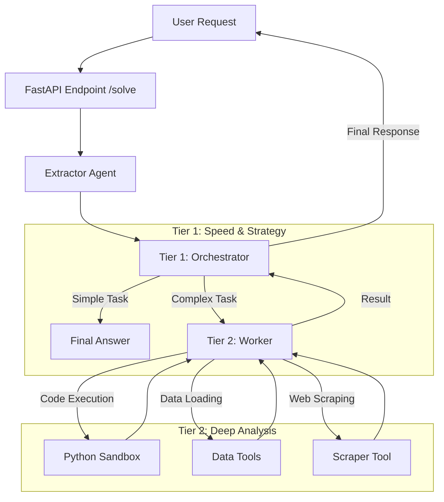
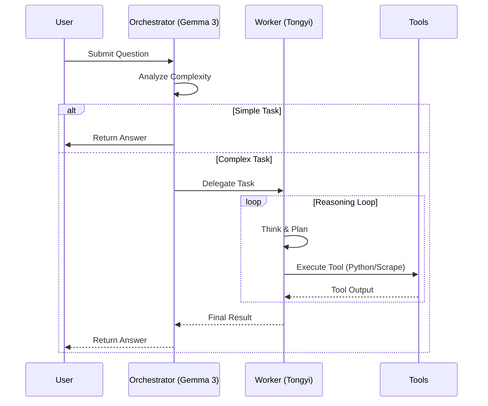

# LLM Analysis Quiz

## Mock Quiz Server
To test the agentic capabilities in a controlled environment, we have included a Mock Quiz Server.

### Features
- **Data Analysis**: Tests PandasAI with dirty CSV data and outlier filtering.
- **Audio Intelligence**: Tests audio transcription and code extraction.
- **Agent Routing**: Verifies the agent can navigate multi-step workflows.

### Running the Mock Server
1. Start the server:
   ```bash
   python mock_quiz_server.py
   ```
   It runs on `http://localhost:8003`.

2. Run the Agent against it:
   You can use the `verify_mock_agent.py` script (to be created) or manually trigger the orchestrator:
   ```python
   from app.orchestrator import Orchestrator
   import asyncio
   
   asyncio.run(Orchestrator().handle_task("http://localhost:8003", "test@example.com", "s3cret"))
   ```
 Solver

A high-performance, two-tier agentic system designed to solve complex data analysis quizzes autonomously. The system leverages a multi-model architecture with **Google Gemma 3**, **Alibaba Tongyi DeepResearch**, and **Google Gemini 2.5** to achieve speed, depth, and multimodal capabilities.

## 🚀 System Architecture

The system employs a **Tiered Agent Architecture** to balance speed and reasoning depth.



### Components

1.  **Extractor Agent**:
    -   **Role**: Pre-processing and data ingestion.
    -   **Capabilities**: Scrapes web pages, downloads files (PDF, CSV, Audio, Archives), and transcribes audio using **Gemini 2.5 Flash Lite**.
    -   **Output**: Structured context (text, file paths, links) for the Orchestrator.

2.  **Tier 1: Orchestrator (Google Gemma 3 27B IT)**:
    -   **Role**: Strategy, delegation, and fast-path solving.
    -   **Capabilities**:
        -   **Fast Path**: Solves simple questions immediately (e.g., "What is the capital of France?").
        -   **Delegation**: Identifies complex tasks (Data Analysis, Coding, File Parsing) and delegates them to Tier 2.
        -   **Multimodal**: Can process images and text directly.
    -   **Model**: `google/gemma-3-27b-it` via OpenRouter.

3.  **Tier 2: Worker (Alibaba Tongyi DeepResearch 30B)**:
    -   **Role**: Execution and deep reasoning.
    -   **Capabilities**:
        -   **Python Sandbox**: Executes secure Python code for data analysis (Pandas, NumPy, Matplotlib).
        -   **Tools**: Handles CSV/Excel/JSON loading, PDF parsing, and Archive extraction.
        -   **Hallucination Safety**: Strictly instructed to distinguish between system secrets and data secrets.
    -   **Model**: `alibaba/tongyi-deepresearch-30b-a3b` via OpenRouter.

## 🛠️ Tech Stack

-   **Backend**: FastAPI, Uvicorn
-   **LLM Orchestration**: Custom Agent Framework (Tier 1/Tier 2)
-   **LLM Providers**: OpenRouter (Primary), Google Gemini API (Direct Audio)
-   **Browser Automation**: Playwright (for dynamic scraping)
-   **Sandboxing**: Restricted Python environment for code execution
-   **Security**: Bandit (SAST), Ruff (Linting)

## 📦 Models Used

| Role | Model | Provider | Reason |
| :--- | :--- | :--- | :--- |
| **Orchestrator** | `google/gemma-3-27b-it` | OpenRouter | High speed, strong instruction following, multimodal support. |
| **Worker** | `alibaba/tongyi-deepresearch-30b-a3b` | OpenRouter | Excellent reasoning, coding, and long-context capabilities. |
| **Audio** | `google/gemini-2.0-flash-lite-preview-02-05` | Google / OpenRouter | Cost-effective, fast, and accurate audio transcription. |

## 🔧 Installation & Setup

### Prerequisites
-   Python 3.11+
-   Docker (optional, for containerized deployment)

### Environment Variables
Create a `.env` file in the root directory:

```env
# API Keys
OPENROUTER_API_KEY=sk-or-v1-...
GEMINI_API_KEY=AIzaSy... (Optional, for direct audio)

# Configuration
QUIZ_SECRET=your_quiz_secret
LOG_LEVEL=INFO
```

### Local Run
1.  **Install Dependencies**:
    ```bash
    pip install -r requirements.txt
    playwright install --with-deps chromium
    ```

2.  **Run Server**:
    ```bash
    python -m uvicorn app.main:app --host 0.0.0.0 --port 8000
    ```

### Docker Run
```bash
docker build -t llm-quiz-solver .
docker run -p 8000:8000 --env-file .env llm-quiz-solver
```

## 🧪 Testing & CI

The project enforces strict code quality:
-   **Linting**: `ruff check .`
-   **Security**: `bandit -r . -c bandit.yaml`
-   **Tests**: `pytest`

### Security Features
-   **Zip Slip Prevention**: `tarfile` extraction uses `filter='data'`.
-   **Secret Safety**: System prompts explicitly prevent the agent from leaking the `QUIZ_SECRET`.
-   **Sandboxing**: Python execution is isolated to prevent system access.

## 📊 Workflow Diagram


